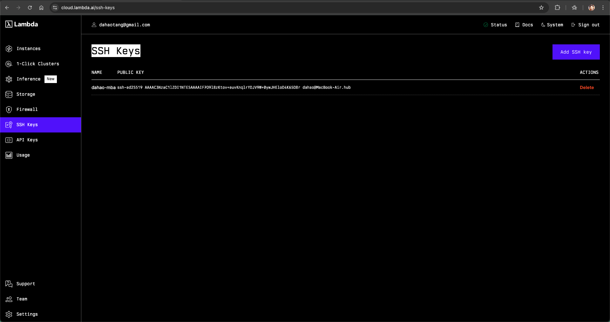
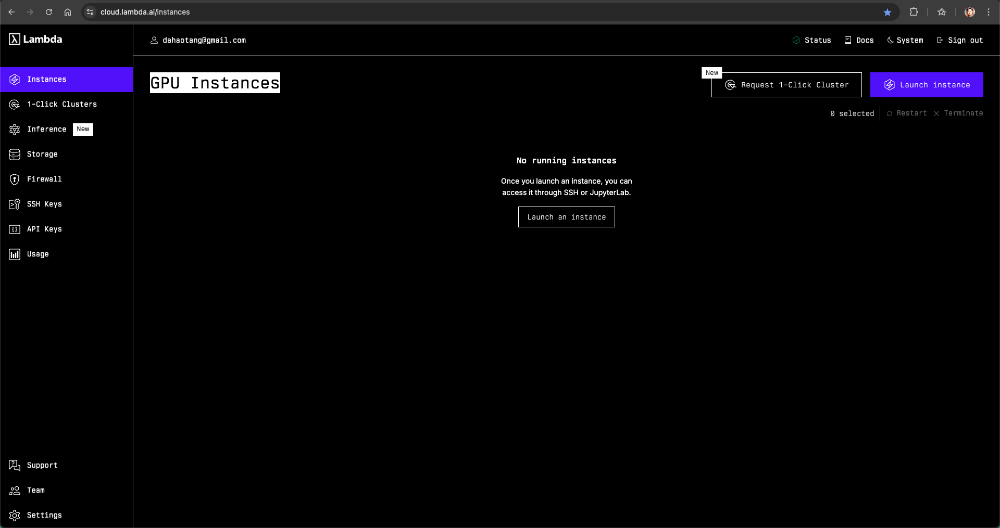
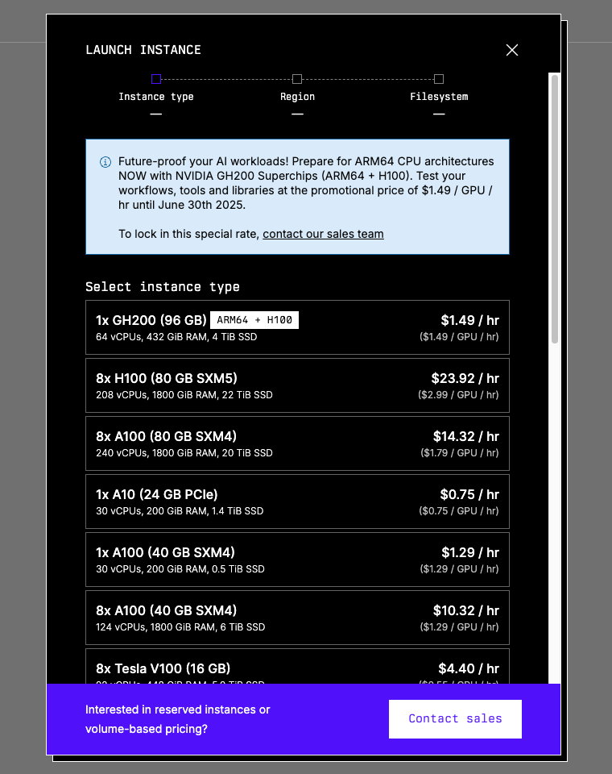
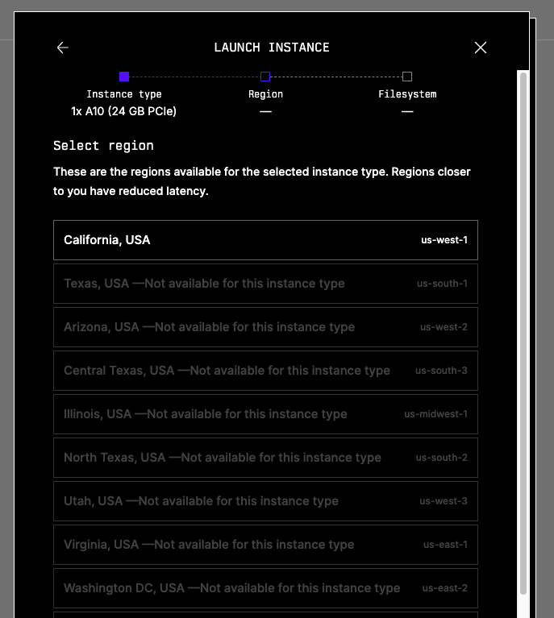
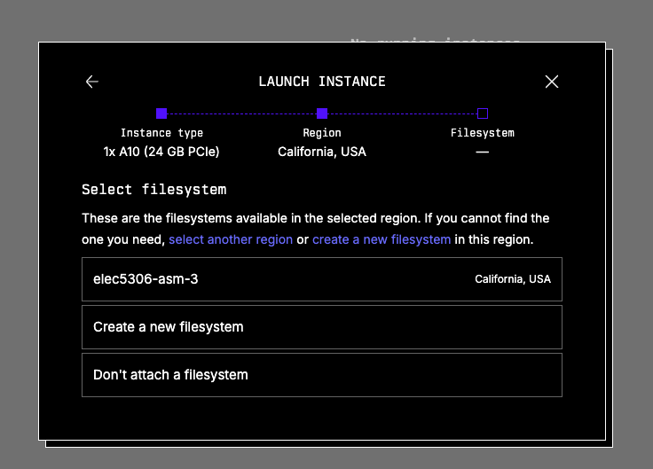
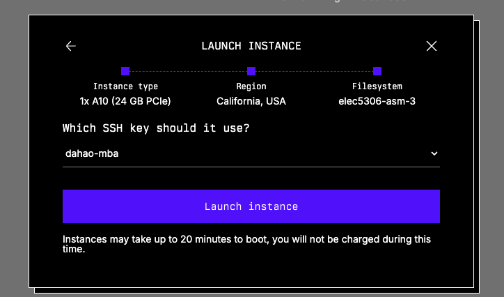
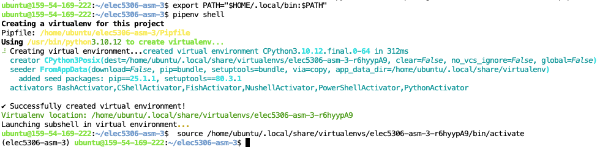
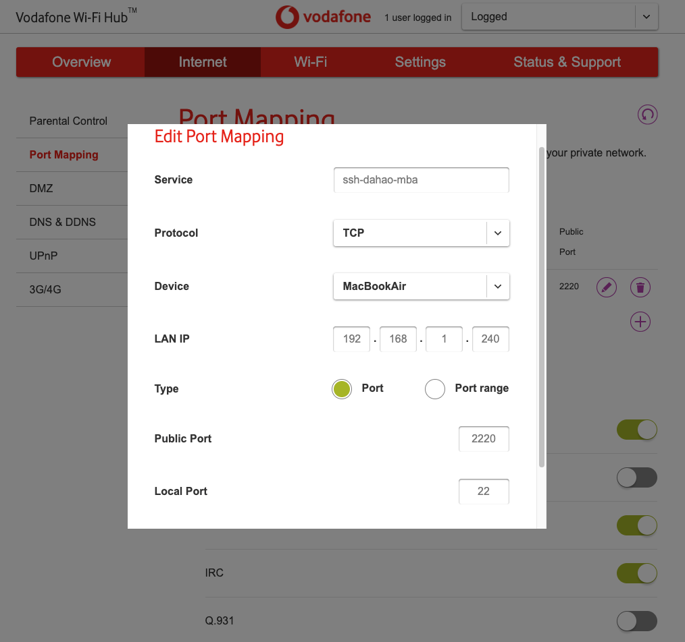
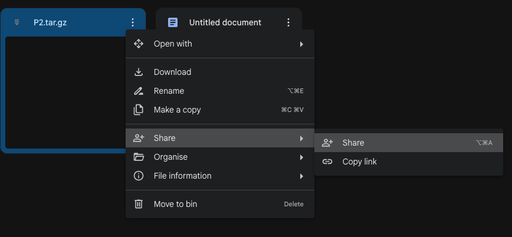
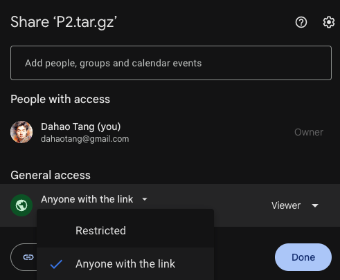

# Train NN with Lambda Cloud

[Home](../../index.html)

May 21

**TL;DR:** This blog is a guide for using [Lambda Cloud](https://lambda.ai/) to do ML training. The blog covers the following content:

- Launch and manage instances and storages on the Lambda Cloud platform
- Use Pipenv as the kernel for the Jupyter Notebook
- Large file transfer
- Conclusion

## Launch an Instance

First, register and log in to the [Lambda Cloud website](https://lambda.ai/).

### Add SSH Key to the Platform

You can add an SSH key to the platform before starting an instance to make the process smoother.

To generate an SSH key on your local machine, execute the command `ssh-keygen` in the terminal and press enter all the way down. Then use the command `cat ~/.ssh/id_<some_id_here>.pub` to view the public key.

Finally, save the public SSH key in the platform.



### Instances and Storage

On Lambda Cloud, the computing service can be done through different methods. One common way is to use an **instance** which can be thought of as _one (long) shot of computing power_. Please note that, once you start an instance, you cannot pause it — **_you will be charged for ALL the time the instance is on._** If you want to “pause” or stop being charged, you should terminate the instance and start another one when needed.

On the other hand, **storage** is more than a “storage”; it is essentially a file system (Ubuntu) that can only be accessed when being attached to an instance _within the same region_. The settings and files stored on the storage will be preserved even if the storage is not attached to any instances. In this manner, you won’t need to re-set up the environment each time you restart an instance – you only need to attach the desired storage to the new instance.

**_Notice: it is of great necessity to back up the files from the storage to your local machine or to another cloud. Because one storage can only be attached to an instance WITHIN THE SAME REGION, which means if the current options for the available GPUs/instances do NOT cover the region where your storage is in, you will NOT be able to access the storage and therefore the files. Or if somehow the storage is dead, you will lose all the files as well._**

With that being said, Lambda Cloud still serves as a strong interface for accessing computing power at an affordable price. So let’s move on to start an instance and a storage.

To start/launch an instance, simply click the “Launch Instance” button at the top right corner:



You will see the current availability of all the GPUs provided — just choose one that matches your needs.



Upon selecting the GPU, you will select the region available. Again, make your pick. If you already have a storage that you want to attach to this instance, choose the region where the storage is at at this step. If there is no shared region, you can only create a new storage or change to another instance type.



Then you will be asked to either create a new storage or attach an existing storage to the instance. You may also choose not to attach any storages, but this is highly NOT recommended.



Finally, you will be asked to choose the SSH key — just choose the one you have just uploaded to the platform, or any other one you want to upload and use now.



You will see an instance booting upon clicking the “Launch instance” button. It may take up 20 minutes to boot (for real). _Sometimes, you will see the instance status become “Alert”, as far as I know and experience, this happens to one of the single-A100 options, you can/should terminate the instance and start a new one._


When the status becomes “Running”, you can click the blue “Launch” text under “CLOUD IDE” to start the Jupyter Notebook service.

## Use Pipenv Virtual Environment as the Kernel for Jupyter Notebook

You may want to set up the environment upon accessing the Jupyter Notebook.

As I am more used to using Pipenv to create the environment, I will show how to set it up for the launched instance.

### Pipenv Installation

We will be able to access the file system, which is a Ubuntu distribution, by starting the terminal in a new notebook tab. Or we can also access the file system (essentially a server when attached to a running instance) using the command `ssh ubuntu@<some_id_here>`. You can find the command under “SSH LOGIN” in the instance page.

By default, Python is installed. We can install pipenv using the following command:

```sh
pip install --user pipenv
```

and add Pipenv to the PATH:

```sh
export PATH="$HOME/. local/bin: $PATH"
```

We can then create/start the Pipenv virtual environment through the command:

```sh
pipenv shell
```



Pipenv Package Installation

Upon building the virtual environment, a Pipfile will be created, which serves as the `requirements.txt`. Implement the file as needed, e.g.:

```txt
[[source]]
url = "https://pypi.org/simple"
verify_ssl = true
name = "pypi"

[packages]
ipykernel = "*"
jupyter = "*"
numpy = "*"
opencv-python = "*"
pillow = "*"
torch = "*"
torchvision = "*"

[dev-packages]

[requires]
python_version = "*"
```

Execute the command `pipenv install` to install all the packages.

### Create and Choose the Kernel for the Jupyter Notebook

You should see the name of the virtual environment from the last auto-command in the last image above: `source /home/ubuntu/. local/share/virtualenvs/<name_of_the_virtual_environment>/bin/activate`

You can also execute the command `pipenv --venv` to get the path to the virtual environment, which contains the name of the virtual environment as well, e.g.:

```sh
/Users/youruser/.local/share/virtualenvs/<name_of_the_virtual_environment>
```

We will then need to create a kernel based on the virtual environment:

```sh
python -m ipykernel install --user --name=<name_of_the_virtual_environment> --display-name "<name_of_the_kernel>"
```

Then we can select the newly created kernel for the Jupyter Notebook. Simply the “Kernel” button in the headbar or clicking the current kernel at the top right corner, and choose the kernel we just created.


So that we can use the kernel created from the Pipenv virtual environment for the Jupyter Notebook.

## File Transfer

We need to do bi-directional file transfer: from the local machine to the instance and from the instance to the local machine, because we want to at least:

1. Be able to upload the training and testing datasets
2. File synchronization

Here I introduce two ways: `scp` and downloading from links

### File Transfer with `scp`

To transfer files from the local machine to the server/instance/storage, simply use the following command:

```sh
scp <path_to_the_file_on_local_machine> ubuntu@<some_id_here>:<path_to_the_file_on_server>
```

If you are transferring a folder, add the flag `-r`:

```sh
scp <path_to_the_folder_on_local_machine> ubuntu@<some_id_here>:<path_to_the_folder_on_server>
```

But I recommend compressing the folder into a `tar.gz` file and transferring it. Because for a typical training and testing dataset, each folder/subfolder will contain a large number of small files. Transferring as a folder may be significantly slower than transferring a file.

It is a bit more complex to transfer from the server/storage/instance to your local machine.

You should first get your current public IP address through the command:

```sh
curl -s https://api.ipify.org
```

Then do the port mapping. Go to http://192.168.1.1/ in your browser to access the router management panel. You should find the user and password from the physical router device. Then you should add a port mapping (same meaning but may be in other expressions…): choose `2220` as the external port and `22` as the internal port for your local device. Here is an example of using a Vodafone router:



Then you can transfer from the server/storage/instance to your local machine using the command:

```sh
scp -P 2220 <path_to_file_on_server> <username>@<public_ip_to_your_devide>:<path_to_file_on_local_machine>
```

Again, add a flag `-r` if you are transferring folders.

#### Bonus: Compression and Decompression with `tar`

On UNIX-like systems, you can compress and decompress easily through the CLI tool `tar`.

To compress a file into a `.tar.gz` file:

```sh
tar -czvf <archive-name>.tar.gz </path/to/directory-or-file>
```

To decompress a `.tar.gz` file:

```sh
tar -xzvf <archive-name>.tar.gz </path/to/directory-or-file>
```

### File Transfer with Cloud Storage Providers

We can also upload and download files from Cloud Storage Providers like Google Drive.

In this post, I will focus on downloading files ONLY.

To download a file from Google Drive, we first go to Google Drive and find the file we want to download to the server/instance/storage. Click on the three-dot button at the top right corner of the file and click on “Share”.



Then we need to make sure “Anyone with the link” is selected for the General Access.



Finally, click “Copy Link” to get the link to the file, which typically follows the following syntax:

```
https://drive.google.com/file/d/<file_id>/view?usp=sharing
```

Note that we can get the file ID of the file on Google Drive.

We use `gdown` to download the file from the Google Drive to the server/storage/instance.

To install `gdown`, we should update the package manager on Ubuntu and install the package:

```sh
sudo apt update
sudo apt install -y gdown
```

Upon completion of installation, we can use the command and the file ID of the file on the Google Drive to download:

```sh
gdown <file_id_on_google_drive>
```

To upload a file from the server/local machine to Google Drive, you can use `gdrive`. Please look into [their official documentation](https://github.com/glotlabs/gdrive) if you are interested. But here I will not expand further.

### Other Options

You may choose other options for file Transfer, for instance, using GitHub, using another Cloud Storage Providers like Dropbox.

But you should be aware of the limitations of your choice. For example, GitHub doesn’t support large files (over 50MB) for the regular/free personal plan, and Dropbox has a storage limitation of 2 GB.

## Conclusion

I tried the cheapest option available when I started an instance: 1x A10 (24 GB PCIe). To my surprise, the same task that would run for 58 minutes on my M1 chip Macbook Air and for 28 minutes on a Mac Minin with the M4 Pro chip and 64GB RAM would run for around 5 minutes using the instance.

I had a similar feeling Steve Jobs had when he managed to use the blue box to hack the telephone network to make free phone calls — one can gain some control over a huge system through such a small system/device. Now people can access great computing power, not one of the greatest on the planet, but still very powerful, within their hands.

_What can be grown from such rich soil…_
