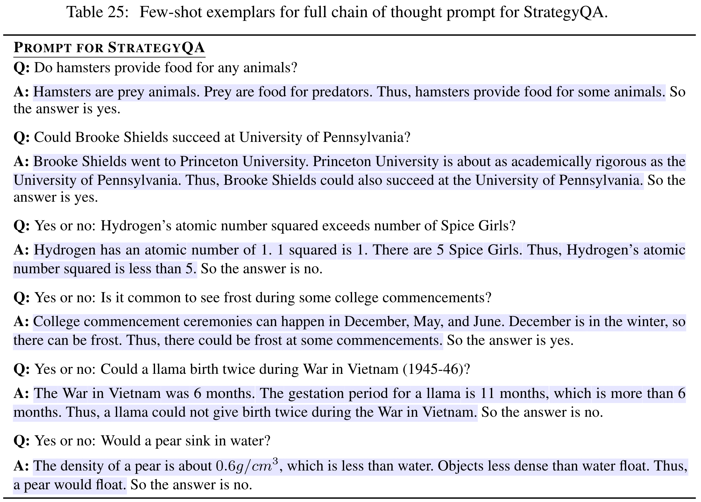
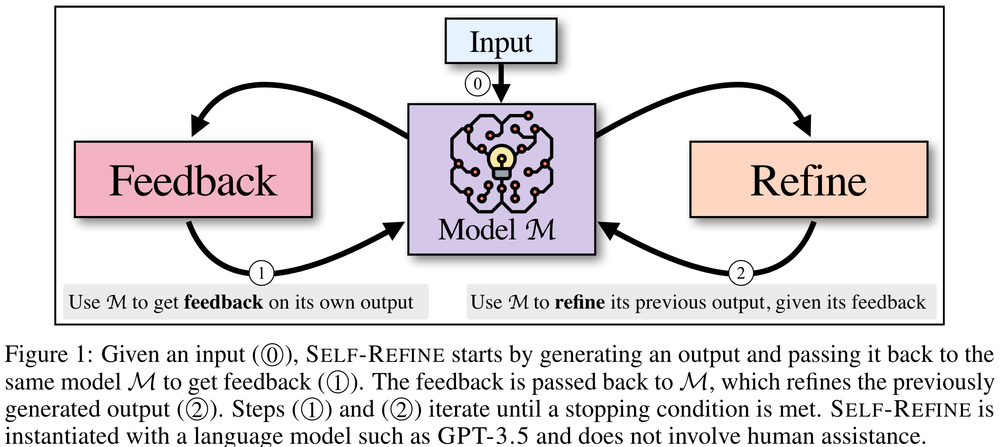
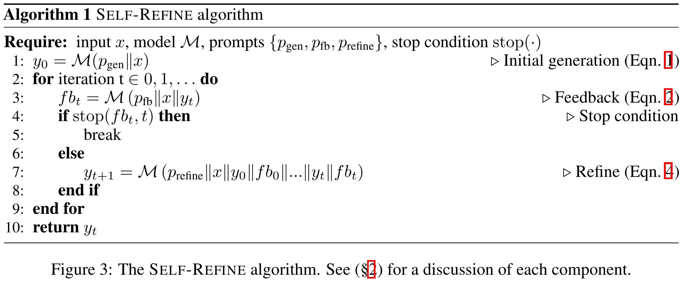

# Reflection in Reflection

## Introduction

I rewatched [Andrew’s talk at Sequoia](https://www.youtube.com/watch?v=sal78ACtGTc&t=197s) these two days and have gained new attention to the topics of **Reflection** and **Multi-agent Collaboration**. In this post, I will focus on the first topic, **Reflection**.

## Key Takeaways

- Reflection is a prompt design pattern rather than a system design pattern.

- The idea of Reflection was brought to light by Wei et al. (2023) as **Chain-of-Thoughts (CoT)**, which is typically created by taking eight exemplars from the training set and decomposing the reasoning process into multiple steps leading to the final answer.

- Inspired by CoT, Madaan et al. (2024) introduced the idea of **Self-Refine**, which is achieved by generating an initial output using an LLM and then using the same LLM to provide feedback for its output, refining itself iteratively.

- A novel framework, **Reflexion**, introduced by Shinn et al. (2024), reinforces language agents not by updating weights but through linguistic feedback.

- All of these techniques achieved **SOTA** at some given task by the time they were introduced.

## Detailed Analysis

### Chain of Thoughts (CoT)

CoT combines two key ideas to unlock reasoning abilities in LLMs:

1. Generating step-by-step natural language rationales improves reasoning tasks.
2. In-context few-shot learning allows task demonstrations without finetuning a separate model.

CoT overcomes these limitations:

- Creating large sets of high-quality rationales is costly.

- Traditional few-shot prompting struggles with reasoning tasks and doesn’t scale well.

Wei et al. (2023) typically created chain-of-thought annotations using eight exemplars from the training set, breaking reasoning processes into multiple steps leading to the final answer.

**Example of CoT Annotations:**

### Self-Refine

Self-Refine generates an initial output with an LLM, then uses the same LLM to provide feedback for its output, refining iteratively.

Steps:

1. Generate an initial output.
2. Use the same model for feedback on the output.
3. Refine the output based on feedback.
4. Repeat until no further refinement is needed or a maximum number of iterations is reached.

Key considerations:

- Feedback must be **actionable** (clear steps for improvement).

- Feedback must be **specific** (identify exact areas needing change).

**Self-Refine Illustration:**

**Algorithm for Self-Refine:**

## Insights

- The idea of finetuning models could be replaced by CoT and other general prompt engineering techniques, reducing training costs and maintaining model generality.

- Self-refine steps can act as a chain of thoughts for reasoning tasks.

- Reasoning in natural language improves model performance due to the prevalence of natural language in LLM training data.

## References

1. Madaan, A., et al. (2024). Self-refine: Iterative refinement with self-feedback. _Advances in Neural Information Processing Systems_, 36.
2. Rae, J. W., et al. (2021). Scaling language models: Methods, analysis & insights from training Gopher. _arXiv preprint arXiv:2112.11446_. [Read here](https://arxiv.org/abs/2112.11446).
3. Shinn, N., et al. (2023). Reflexion: Language agents with verbal reinforcement learning. _arXiv preprint arXiv:2303.11366_. [Read here](https://arxiv.org/abs/2303.11366).
4. Brown, T., et al. (2020). Language models are few-shot learners. _NeurIPS_.
5. Wei, J., et al. (2023). Chain-of-thought prompting elicits reasoning in large language models. _arXiv preprint arXiv:2201.11903_. [Read here](https://arxiv.org/abs/2201.11903).
