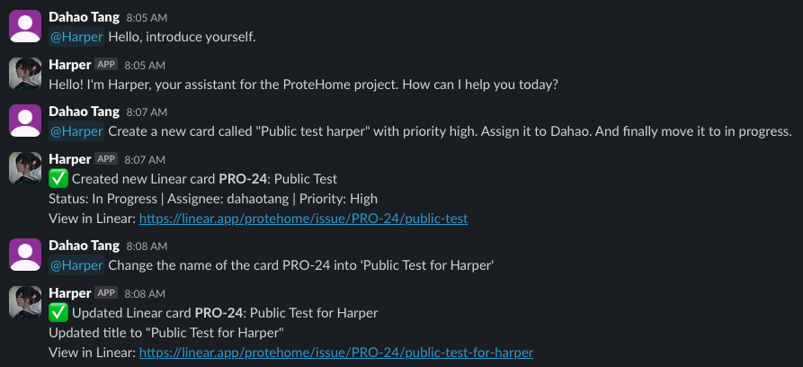
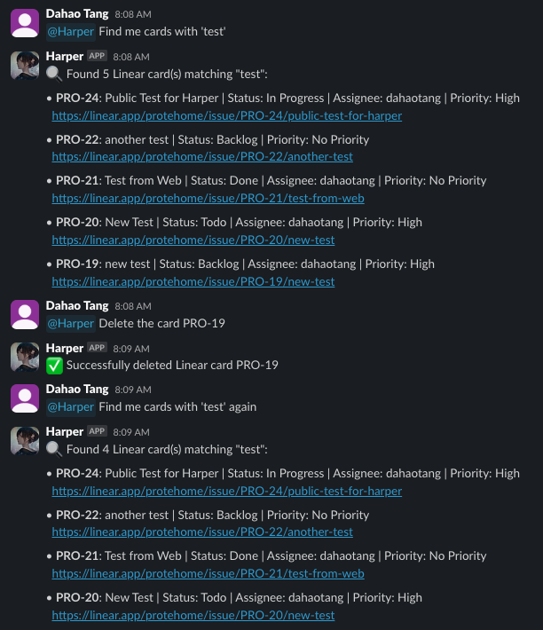

# Harper: AI Assistant for Simplifying Project Management Workflow

April 24

**TL;DR:** Meet Harper — an AI assistant designed to simplify project management workflows. Born from real needs during the ProteHome project at USYD’s David James Lab, Harper helps bridge communication and task-tracking by integrating project boards with Slack. This post covers the origin story, basic use cases, and a peek into the core technical folder structure.

## Where does this idea come from?

Let me introduce [Harper](https://github.com/DahaoTang/Harper), an AI assistant built to make project management easier. Harper started as an internal tool for the ProteHome project at the David James Lab at the Charles Perkins Centre, University of Sydney.

The inspiration came from a simple but powerful idea:
“Develop for develop” — how can we create something now that makes future development smoother?

Let’s be honest: building a brand new tool always sounds more exciting than improving an existing one. But we’ve learned to approach those ideas carefully. Still, it’s always worth asking: `Is there something we can build to just make life easier?`

The answer is obviously “Yes!”. The question is “What?”.

## Start with the Workflow

As a small team (about 5 devs, most of us undergrads), our top priority was to get our core product, ProteHome, up and running. Designing an ideal workflow took a backseat. But even with a lightweight setup, we did use some basic tools:

1. GitHub: for code collaboration
2. Slack: for all communication
3. Trello: for project management… though, barely used

If we take a closer look at the time we spend on each of these tools, the answer to what to improve is obvious:

1. GitHub: Used mostly for PRs; not a huge time sink
2. Slack: We spend **a massive amount of time** on Slack; this is the only way we do all kinds of communication besides the one-hour-long weekly meetings.
3. Trello: **ALMOST ZERO**.

And yet, we know project boards are important — they get mentioned in every Agile class for a reason. Not because it’s trendy, but because once a project grows, having a board isn’t enough. Using it properly becomes critical.

So we asked:
_Why don’t we use Trello/Linear?_
Or better: **_How can we make it easier to use?_**

## What if we could use Trello/Linear through Slack?

Since Slack is where we live, why not bring the board to us?

### Integration with Slack

There are a couple of ways to go about this:

The no-code route: Tools like Trello or Linear already offer native Slack integrations. Link them up, and you can control the board with simple commands. It’s quick and easy, but over time, limited by its rigidity.

The bot route: Build an assistant you can talk to in natural language. Ask it to create a task, check status, update items — all in Slack. That’s where Harper comes in.

And the best part? These two approaches aren’t mutually exclusive. You can combine both for short-term convenience and long-term flexibility.

## Meet Harper: Basic Use Cases

With that in mind, I built the first version of Harper — a bot that connects Slack to project tools like Linear, and eventually, more.

Here’s a simple example of how Harper works:





As you can see, currently Harper supports only interactions with a board, Linear, and mainly focuses on the management of cards/issues. I chose Linear over Trello because Linear is optimized for programming. But more importantly, I am not the admin of the Trello board we are using (hence I cannot use the APIs), and I prioritize passion and speed :)

## A very quick glance at the core folder structure

The project is made public on GitHub: [Harper](https://github.com/DahaoTang/Harper).

The core of Harper is the `lib` folder:

```
lib
├── adapters
│   ├── linear
│   │   └── api.ts
│   ├── openai
│   │   └── api.ts
│   └── slack
│       └── api.ts
├── config
│   └── harper.ts
├── services
│   ├── handlers
│   │   ├── general.ts
│   │   ├── linear.ts
│   │   └── welcome.ts
│   └── intent
│       ├── detector.ts
│       ├── index.ts
│       └── router.ts
└── types
    ├── intent.ts
    └── linear.ts
```

The `adapters` talk to the APIs from the provider. The `services`, especially the `handlers`, deal with the logic for user messages from Slack.

_I may post another blog on the details of the implementation, including the process of development and an explanation of the current code._
